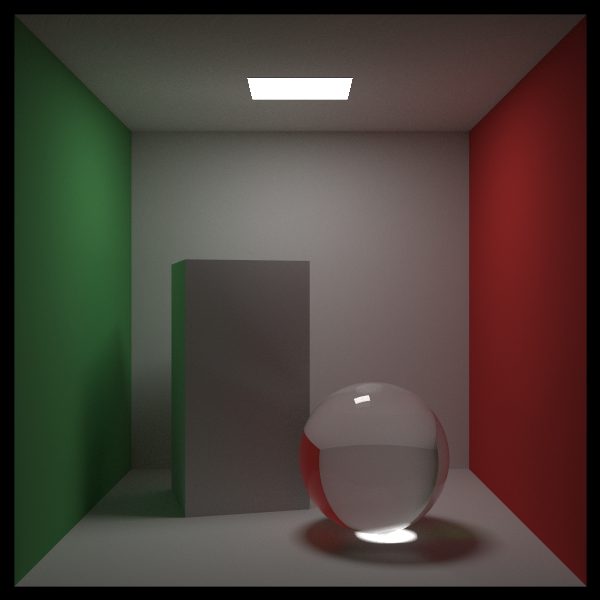
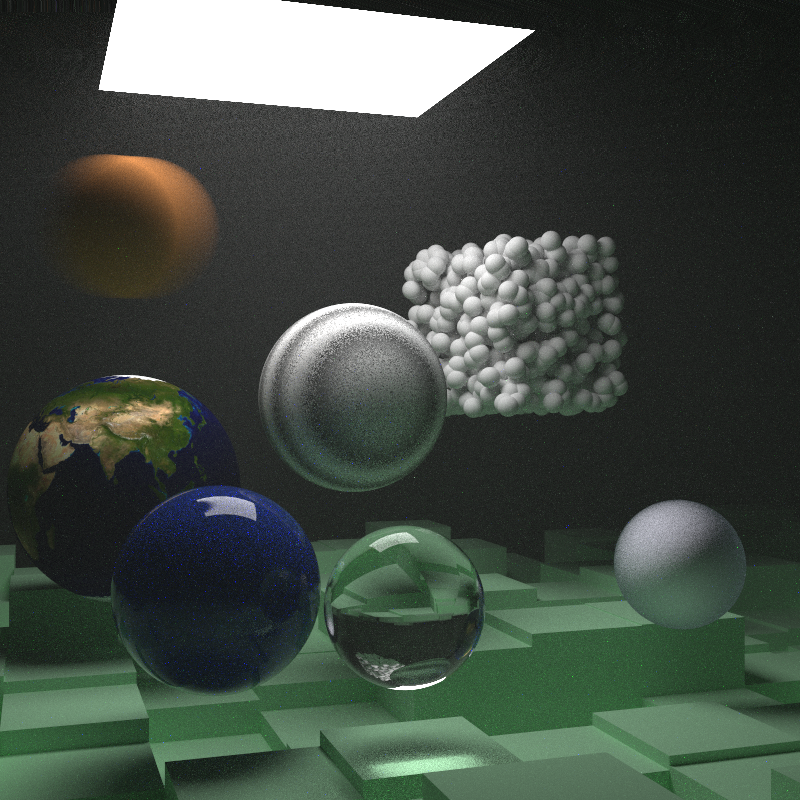
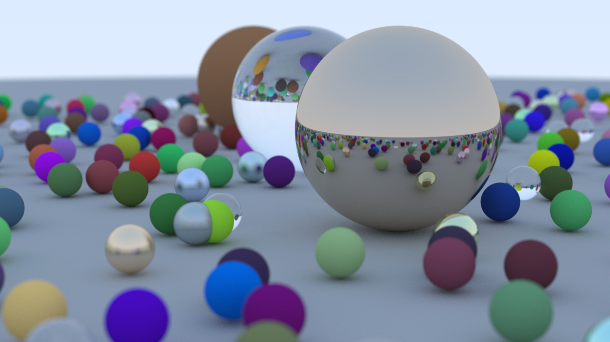

# 🎨 ToyRender - 基于物理的光线追踪渲染器

<div align="center">


一个基于《Ray Tracing in One Weekend》系列实现的高性能光线追踪渲染引擎

[特性](#-特性) •
[渲染效果](#-渲染效果) •
[技术架构](#-技术架构) •
[快速开始](#-快速开始) •
[后续规划](#-后续规划)

</div>

---

## 📖 项目简介

ToyRender 是一个从零实现的光线追踪渲染器，完整跟随 Peter Shirley 的《Ray Tracing in One Weekend》三部曲教程，实现了现代光线追踪的核心算法和优化技术。项目采用 C++17 标准开发，支持多线程并行渲染，能够生成照片级真实感图像。

## ✨ 特性

### 核心渲染功能
- **📐 基础几何体**：球体、矩形、立方体等基本图元
- **🎯 相机系统**：可配置的相机参数（FOV、景深、运动模糊等）
- **💡 光照模型**：
  - Lambertian 漫反射材质
  - 金属材质（可调糙度）
  - 电介质材质（折射、反射）
  - 自发光材质
- **🖼️ 纹理系统**：
  - 纯色纹理
  - 棋盘纹理
  - Perlin 噪声纹理
  - 图像纹理映射
- **🌫️ 体积渲染**：恒定密度介质（烟雾、雾效）

### 性能优化
- **⚡ BVH 加速结构**：边界体层次结构优化光线求交
- **🔄 OpenMP 多线程**：充分利用多核 CPU 并行计算
- **📊 重要性采样**：蒙特卡洛积分优化

### 高级特性
- **🎲 概率密度函数采样**：提升渲染质量和效率
- **📏 正交基系统**：支持复杂光照计算
- **🔧 可配置渲染参数**：分辨率、采样数、递归深度等

## 🎨 渲染效果

<div align="center">

### Cornell Box 经典场景


### 完整特性展示


### 综合场景渲染


</div>

## 🏗️ 技术架构

```
toyrender/
├── core/                   # 核心渲染引擎
│   ├── camera.h           # 相机系统
│   ├── material.h         # 材质系统
│   ├── texture.h          # 纹理系统
│   ├── hittable.h         # 可碰撞对象接口
│   ├── sphere.h           # 球体几何体
│   ├── quad.h             # 四边形几何体
│   ├── bvh.h              # BVH 加速结构
│   ├── pdf.h              # 概率密度函数
│   ├── perlin.h           # Perlin 噪声生成
│   ├── ray.h              # 光线类
│   ├── vec3.h             # 三维向量数学库
│   └── main.cpp           # 主程序入口
├── external/              # 第三方库
│   └── stb_image.h        # 图像加载库
├── demo/                  # 渲染效果图
└── CMakeLists.txt         # CMake 构建配置
```

### 核心模块说明

| 模块 | 功能描述 |
|------|---------|
| **Ray Tracing Core** | 光线投射、求交检测、递归追踪 |
| **Material System** | BRDF 材质模型、光线散射计算 |
| **BVH Acceleration** | 空间划分加速结构，O(log n) 求交 |
| **Sampling System** | 蒙特卡洛采样、重要性采样 |
| **Camera System** | 透视投影、景深效果、运动模糊 |

## 🚀 快速开始

### 环境要求
- C++17 兼容的编译器（GCC 7+、MSVC 2017+、Clang 5+）
- CMake 3.18 或更高版本
- OpenMP 支持（可选，用于多线程加速）

### 编译步骤

```bash
# 克隆项目
git clone https://github.com/yourusername/toyrender.git
cd toyrender

# 创建构建目录
mkdir build && cd build

# 配置项目
cmake ..

# 编译
cmake --build .

# 运行渲染器
./toyrenderer > output.ppm
```

### 渲染参数配置

在 [main.cpp](core/main.cpp) 中可以调整以下参数：

```cpp
int image_width = 800;        // 图像宽度
int samples_per_pixel = 500;  // 每像素采样数（越高质量越好）
int max_depth = 50;           // 光线追踪最大递归深度
```

## 📚 技术亮点

1. **完整的物理模型**：基于物理的渲染方程，支持全局光照
2. **高效的加速结构**：BVH 实现将渲染时间从小时级优化到分钟级
3. **并行化计算**：OpenMP 多线程实现，充分利用多核性能
4. **模块化设计**：清晰的代码结构，易于扩展和维护
5. **蒙特卡洛积分**：随机采样实现软阴影、景深等真实效果

## 🔮 后续规划

- [ ] **GPU 加速**：使用 CUDA 重写核心渲染管线，实现实时渲染
- [ ] **更多几何体**：三角网格、OBJ 模型加载
- [ ] **高级材质**：BSDF 模型、次表面散射
- [ ] **PBRT v4 特性**：参考 Physically Based Rendering 加入更多高级功能
  - 光谱渲染
  - 双向路径追踪
  - 光子映射
- [ ] **交互式预览**：OpenGL/Vulkan 实时预览窗口
- [ ] **场景描述语言**：JSON/XML 格式的场景文件支持

## 📄 参考资料

- [Ray Tracing in One Weekend](https://raytracing.github.io/)
- [Physically Based Rendering: From Theory to Implementation](https://www.pbr-book.org/)
- [NVIDIA OptiX Ray Tracing Engine](https://developer.nvidia.com/optix)

## 📝 License

本项目采用 MIT License 开源协议。

---

<div align="center">

**⭐ 如果这个项目对你有帮助，欢迎 Star！**

Made with ❤️ by [Your Name]

</div>